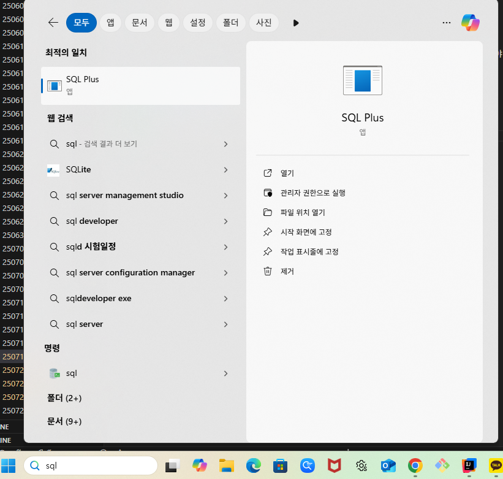
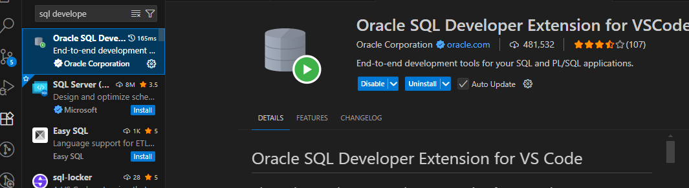

## TIL - 2025.07.18

### 🔍 오늘 배운 내용

#### 스프링: 빈 관리, 어노테이션 사용, MVC 의존성 주입

**빈(Bean) 관리**   
스프링에서 빈은 스프링 IoC 컨테이너가 관리하는 객체를 의미한다. 스프링은 애플리케이션 내에서 객체의 생성, 구성, 관리 및 소멸을 책임지고 관리한다.
```
// 빈 등록
스프링에게 관리를 위임할 객체들을 등록하기 위하여 빈 등록을 해야 한다.
@Component 또는 각 클래스의 기능에 맞게 @Service, @Repository, @Contorller 어노테이션을 붙여준다.

@Component: 일반적인 빈
@Service: 비즈니스 로직을 담고 있는 서비스 계층 정의
@Repository: 데이터 접근 계층(DAO) 정의
@Controller: 웹 애플리케이션 컨트롤러 계층 정의

controller(웹 요청, 응답) >> service(데이터 가공) >> repository(데이터 CRUD, DB 접근)
```

**어노테이션 사용**
```
// Controller
@Controller 또는 @RestController
public class Controller {
    // 정제된 데이터를 받아올 의존 객체 service 정의 
    private final Service service;

    // 생성자로 의존성 주입

    // 필요한 의존객체를 자동으로 결합해주는 어노테이션
    // 생성자가 하나면 생략 가능 
    @Autowired 
    public Controller(Service service) {
        this.service = service
    }
}

// Service
@Service
public class Service {
    // 데이터를 받아올 의존 객체 repository 정의
    private final Repository repository;

    // 생성자로 의존성 주입
    // @Autowired
    public Service(Repository repository) {
        this.repository = repository;
    }
}

// Repository
@Repository
public class Repository {

}
```
롬복을 활용하면 더 간단하고 가독성 높게 작성가능하다.
```
// Controller
@RestController

// final 필드만 골라서 생성자 생성해줌
// 생성자와 Autowired 생략 가능
@RequiredArgsConstructor 
public class Controller {
    // 의존 객체 
    private final Service service;
}

// Service
@Service
@RequiredArgsConstructor 
public class Service {
    // 의존 객체 
    private final Repository repository;
}

// Repository
@Repository
@RequiredArgsConstructor 
public class Repository {
}
```
아래 어노테이션들은 @SpringBootApplication 스프링 부트에서 대부분 자동으로 처리해줌
```
// 자바 클래스를 설정 파일로 만듬
@Configuration 

// 직접 객체를 빈으로 등록하고 싶을 때 사용
// 대부분의 경우 스프링이 @Component, @Service, @Repository로 
// 자동으로 빈 등록을 해줌
@Bean

// 특정 패키지 이하에서 @Component가 붙은 
// 클래스들을 자동으로 찾아서 빈으로 등록
// @Controller, @Service, @Repository의 내부에 @Component가 작성되어있음
@ComponentScan(basePackages = "")
```

**MVC 의존성 주입**   
스프링 3계층 구조   
애플리케이션을 세 개의 주요 계층, Controller, Serivce, Repository로 나눈다. 
- Controller   
    - Http 요청을 처리하고 응답을 반환
    - URL 매핑을 통해 메소드를 실행
    - Service 계층으로 비즈니스 로직 처리를 위임
```
@RestController
@RequestMapping("")
@RequiredArgsConstructor
public class Controller {

    // 의존 객체 설정
    private Service service;

    @GetMapping("")
    public ResponseEntity<?> list() {
        
        // 필요한 처리를 service에게 위임
        List<DTO> response = service.listProcess();

        return ResponseEntity.ok(response);
    }
}
```
- Service  
    - 핵심 비즈니스 로직을 구현(데이터 변환 및 예외처리)
    - 트랜잭션 처리 담당
```
@Service
@RequiredArgsConstructor
public class Service {

    // 의존 객체 설정
    private Repository repository;

    // 각 기능별 비지니스 로직 작성
    public List<DTO> listProcess() {
        // 리포지토리에게 데이터(DB) 처리를 위임
        repository.();
        return ;
    }
}
```
- Repository
    - 데이터베이스와 직접적인 통신 담당
    - CRUD 작업 수행
```
@Repository
@RequiredArgsConstructor
public class Repository {
    // 데이터 처리 로직 작성
    // 데이터베이스와 연결
}
```
   
각 계층 간 데이터 전달 시 DTO를 활용하여 필요한 데이터만 전달할 수 있게 로직을 작성해야 한다.   


#### SQL: DB 설치 
Oracle database XE 설치   
setup.exe를 관리자 권한으로 실행   
Oracle 관리자 계정: system/oracle(연습용 db)   
   
실행 후 사용자명 입력: system / 비밀번호: oracle 입력   
vscode 에서 sql developer 플러그인 설치   
   


