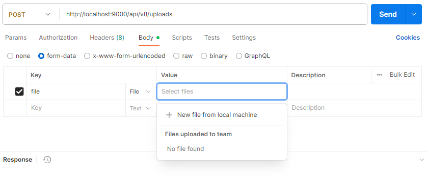

## TIL - 2025.07.17

### 🔍 오늘 배운 내용

#### 스프링: 파일 업로드 처리, 마리아 DB 설치 및 연결, 스프링 JDBC, 

**파일 업로드 처리**   
파일 업로드: 클라이언트가 로컬 파일(이미지, 문서, 동영상 등)을 서버로 전송하는 작업.   
스프링 부트에서는 MultipartFile 객체를 사용하여 업로드를 간단하게 처리함   

스프링 부트에서 파일 업로드 처리하기   

1. 파일 업로드 지원을 위해 multipart 요청을 활성화
```
// application.yml 에 해당 내용 추가
spring:
  servlet:
    multipart:
      max-file-size: 10MB 
      max-request-size: 100MB

// 클라이언트가 올린 파일들을 저장할 루트 지정
file:
  upload:
    location: ${user.home}/spring/upload/
```
- max-file-size: 업로드할 파일 1개의 최대 용량을 제한
- max-request-size: 한번에 업로드할 수 있는 파일의 총 용량

application.properties: 키, 밸류 쌍으로 데이터를 관리      
application.yml: 설정을 단계적으로 작성하여 관리를 용이하게 함
```
// application.properties
spring.servlet.multipart.max-file-size=10MB  
spring.servlet.multipart.max-request-size=100MB

// application.yml
// . 을 다 : 으로 변경
spring:
  servlet:
    multipart:
      max-file-size: 10MB 
      max-request-size: 100MB
```

2. 파일 업로드 요청을 처리하는 컨트롤러 작성   
MuliparteFile 주요 메소드   
- getOriginalFilename(): 업로드된 파일의 원래 이름을 반환.
- getSize(): 파일 크기를 반환.(바이트 단위)
- getContentType(): 파일의 MIME 타입 반환.
- isEmpty(): 비어있는 파일인지 여부 확인.
- transferTo(File dest): 파일을 저장된 위치로 저장

```
// 파일 업로드 요청 -> POST 매핑
@PostMapping("/uploads")
public ResponseEntity<?> uploadSingleFile (
  @RequsetParam("file")
  MultipartFile originFile // MultiparteFile 객체를 사용
) {
    // 업로드한 파일 이름 확인
    log.info("upload file name: {}", originFile.getOriginalFilename());
    // 업로드한 파일의 타입, 메타데이터 확인
    log.info("upload file name: {}", originFile.getContentType());

    return ResponseEntity.ok();
}
```
포스트맨으로 파일 업로드하기   
post > body >  @RequestParam("file") 에 작성했던 file을 키에 입력 >    
value 를 file로 선택 후 select file > New file from local machine > 파일업로드   
   

3. 로컬(서버)에 파일 저장하기   
application.yml에 작성했던 루트경로에 파일 생성
```
// application.yml
file:
  upload:
    location: ${user.home}/spring/upload/
```
지정한 경로를 관리하는 설정 파일(클래스) 생성
```
// config.FileUploadConfig
@Getter
@Configuration // 이 어노테이션이 붙으면 논리적으로 설정 파일로 인식
public class FileUploadConfig {

  // application.yml 파일 루트 경로 읽어오기
  private String location = 'C/~~'; 
  ※ 이렇게 작성하면 정보 다 털림. 설정파일로부터 주소를 입력받아야 함

  @Value("${file.upload.location}")
  private String location;

  // 루트 경로가 있는지 확인하고 없으면 생성
  @PostConstructor // 빈이 생성되는 순간(서버 켜질 때) 자동으로 1회 실행
  public void init() {
    File directory = new File(location)
    if(!directory.exists()) directory.mkdirs();
  }
}
```
파일 저장하기
```
@RequiredArgsConstructor
{
  // @configruation 도 @component로 스프링이 관리함
  privat final FileUploadCongif fileUploadConfig;

  public ResponseEntity<?> uploadSingleFile () {

    // 루트 디렉토리 가져오기
    String rootDir = fileUploadConfig.getLocation();

    // 파일명 가져오기
    String originalFilename = originFile.getOriginalFilename();
    // 확장자만 분리하기
    String extension = originalFilename.substring(originalFilename.lastIndexOf("."));
    // 파일명 랜덤하게 변경하기
    // 파일 이름에 ../와 같은 경로 조작 문자열이 포함되지 않도록 보안을 고려해야한다.
    String filename = UUID.randomUUID().toString() + extension;

    String fullName = rootDir + filename;
    File uploadedLocation = new File(fullName);

    // 파일 전송
    try {
        ogriginFile.transferTo(uploadedLocation) // uploadedLocation으로 업로드된 파일을 이동
    } catch (IOException e) {
        return ResponseEntity.internalServerError().body("파일 저장 실패!");
    }

    return ResponseEntity.ok();

  }
}
```

4. 다중파일 입력받기   
다중파일은 파라미터를 List<MultipartFile> 로 입력받고 저장할때 반복문을 활용하여    
하나씩 꺼낸 후 단일파일에서 파일명 변경하고 전송한 내용을 반복하면 된다.
```
@PostMapping("/uploads")
public ResponseEntity<?> uploadSingleFile (
  @RequsetParam("files")
  List<MultipartFile> originFiles 
  .
  .
  .
  
  for(MultipartFile originFile : originFiles) {
    .
    .
    .
  }
)
```

5. 업로드한 파일에 접근하기   
WebMvcConfigurer를 활용
```
@Configuration
@RequiredArgsConstructor
public class WebResourceConfig implements WebMvcConfigurer {
  
  private final FileUploadConfig fileUploadConfig;

  @Override
  public void add ResourceHandlers(ResourceHandlerRegistry registry){
        /*
            파일 서버에 저장된 C:/Users/user/spring/upload 안에 들어있는 파일들을
            백엔드서버에서 http://localhost:9000/uploads/파일명 -> 했을 때 꺼내주겠다.
         */
        registry.addResourceHandler("/uploads/**")
                .addResourceLocations("file:" + fileUploadConfig.getLocation());
    }

}
```
- addResourceHandler: /uploads/**, http:~/uploads/ 로 시작하는 요청을 처리
- addResourceLocations: file: 접두사를 사용하여 파일 시스템 경로를 지정   


**스프링 JDBC**   
JDBC   
자바 언어를 사용해 데이터베이스에 접근할 수 있도록 하는 자바 API   

스프링 JDBC   
스프링에서 제공하는 JDBC 모듈(스프링에서 제공하는 JDBC 추상화 라이브러리)   
JDBC 코드를 간결하게 작성하고 더 쉽게 데이터베이스와 상호 작용할 수 있도록 돕는 역할   

스프링 JDBC 작성   
1. 테이블 생성 및 엔티티 생성
테이블을 생성 후 테이블과 연결될 엔티티를 작성한다. 엔티티의 필드명은 테이블의 칼럼명과 동일하게 만들되   
자바의 문법을 따라야 한다.(테이블: 스네이크케이스 -> 자바: 케멀케이스) 동일하게 작성하면 스프링이 자동으로 매칭해줌
```
/*
   book 테이블 구조
   | id | title | author | isbn | available | created_at |
   |----|-------|--------|------|-----------|------------|
   |    |       |        |      |           |            |
*/
// entity
public class Book {

  private Long id;
  private String title;
  private String author;
  private String isbn;
  private boolean available;
  // ※ 스네이크 케이스로 작성된 db 칼럼명을 자바에서는 캐멀케이스로 작성
  private LocalDateTime createAt;

}
```
2. 


#### SQL: SELECT