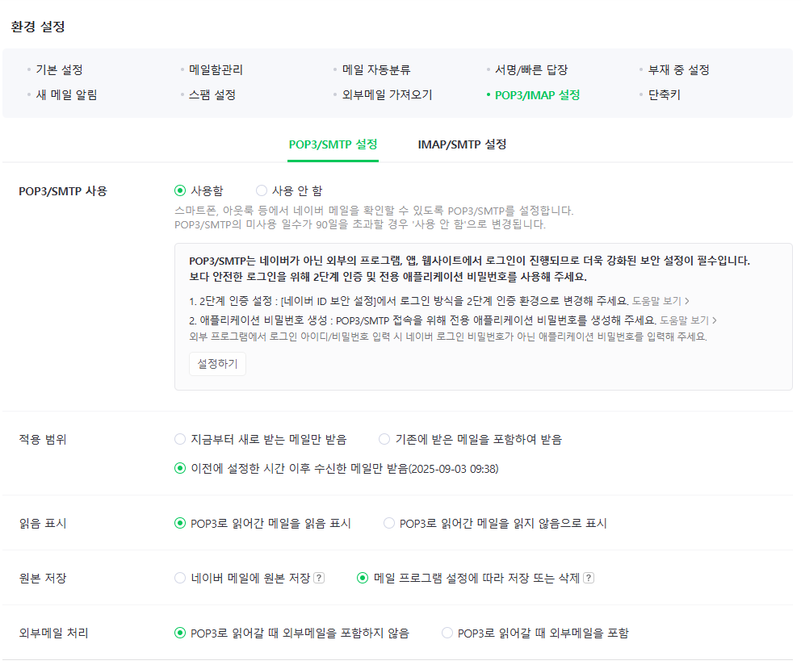

## TIL - 2025.09.01

### 🔍 오늘 배운 내용
- 리액트 + 백엔드 프로젝트 설정
- api 호출을 컴포넌트 본문에서 실행할 때 발생하는 문제점 ==> useEffect로 해결 => 렌더링 된 이후에 useEffect로 api를 호출, 호출 순서에 문제가 있고 호출되는 동안 빈화면 노출되어 사용자 경험 v
- loader 함수
- useLoaderData
- loader 아웃소싱
   
```
export const eventItemLoader = async (x) => {
    //const response = await fetch(`${DEFAULT_URL}/${eventId}`)
    console.log(x)
    //return response;
}
```

---

#### 리액트 + 백엔드 프로젝트 설정   
두가지 언어로 풀스텍 프로젝트를 만들기 위해 인텔리제이로 프로젝트 기본 설정을 진행했다.   

1. 빈 프로젝트 생성   

   

2. 모듈로 백엔드 / 프론트엔드 환경 설정   

   

모듈로 각 환경에 맞는 설정을 진행하고 아래 사진과 같이 backend / frontend로 폴더 구조를 설정하면 된다.

   

- record   
> 
---

- 