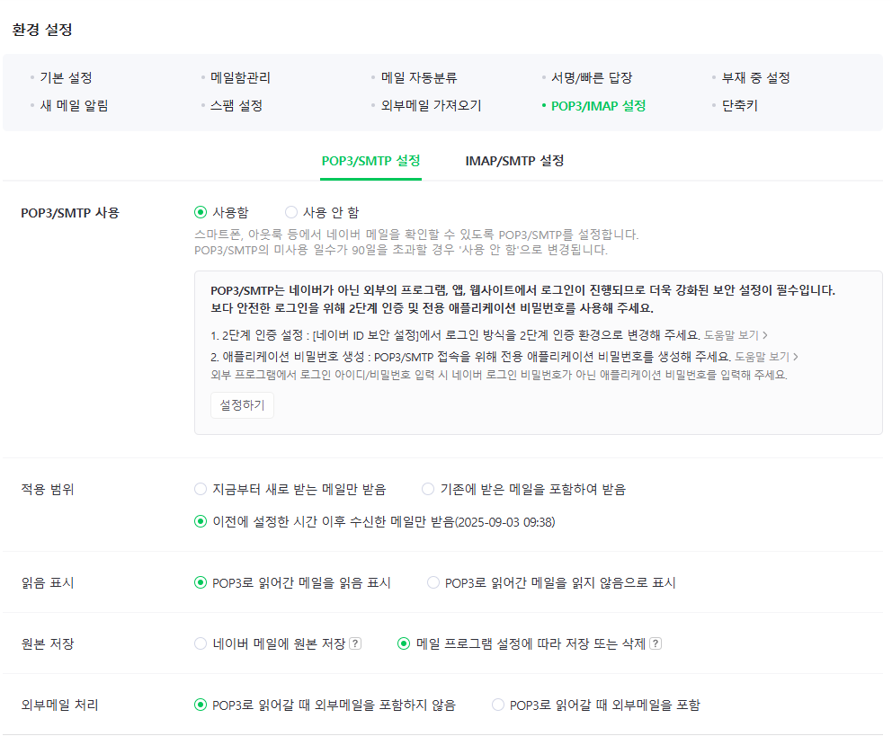
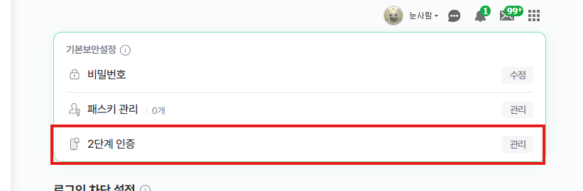
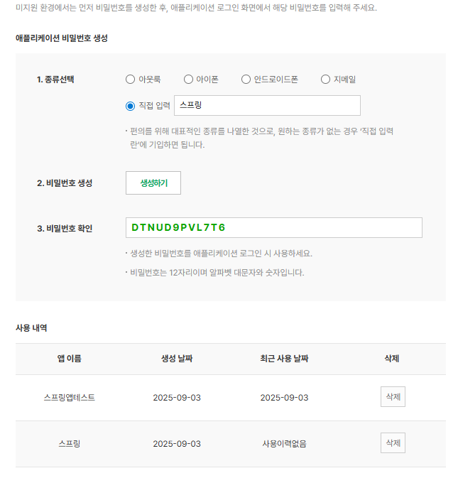
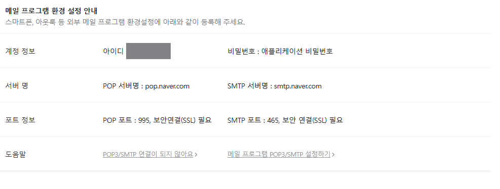
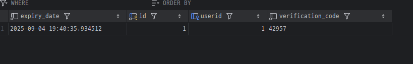

## TIL - 2025.09.03

### 🔍 오늘 배운 내용
- 이메일 인증 
- 다중 Ref 처리

---

#### 이메일 인증
회원가입 중 이메일 인증 로직을 구현하기 위해 학습했다.   

이메일 인증 과정은 아래 3단계로 나눌 수 있다.   
1. 서버에서 인증번호 생성
2. 서버에서 이메일 발송 
3. 클라이언트 인증번호 입력   

-  SMTP 생성   
> SMTP란?   
Simple Mail Transfer Protocol의 약자로 인터넷을 통해 이메일 메시지를 보내고 받는데 사용되는 통신 프로토콜이다. 메일 서버 및 기타 메세지 전송 에이전트(MTA)는 SMTP를 사용하여 메일을 보내고 받는다.

SMTP 프로토콜로 메일을 주고받을 SMTP 서버는 네이버 메일을 사용했고 아래 사진과 같이 설정했다.   

1. 좌측 하단 환경설정 클릭 > 아래 선택된 화면과 동일하게 선택 > 설정하기 눌러서 2단계 인증 진행
   
2. 2단계 인증 선택 후 인증 진행
   
어플리케이션 비밀번호 생성 진행   
비밀번호 생성으로 생성된 비밀번호는 application.yml에 작성될 비밀번호로    
진짜 비밀번호를 사용하지 않고 생성된 비밀번호로 메일발송에 사용한다.
   
3. application.yml 설정   
아래 계정정보와 서버명을 확인하여 application.yml에 작성한다.
   
spring: 아래에 작성하면 된다.
    ```
    # mail send setting
    mail:
        host: smtp.naver.com
        port: 465
        username: // 아이디
        password: // 생성한 비밀번호
        protocol: smtp
        properties:
        mail:
            smtp:
            auth: true
            ssl:
                enable: true
    ```

- 인증메일 발송 로직 작성   
1. 회원가입 시 메일을 먼저 입력받아 중복여부를 확인한다.   
flag가 true면 중복된 이메일이고, false면 사용가능한 이메일이다.   
api controller 단으로 true/false로 결과를 전달한다.
    ```
    public boolean checkEmailDuplicate(String email) {

            boolean flag = userRepository.existsByEmail(email);
            log.info("email - {} is duplicated: {}", email, flag);

            return flag;
        }
    ```
2. 중복된 메일이 아니면 인증코드를 생성한다.   
    ```
    // 이메일 인증 코드 발송 로직
    private String sendVerificationEmail(String email) {
        // 인증코드 생성
        return generateCode();
    }

    // 무작위로 10000 ~ 99999 사이의 랜덤 숫자를 생성
    private String generateCode() {
        return String.valueOf( (int) (Math.random() * 90000) + 10000);
    }
    ```
    중복확인 코드를 수정하여 인증코드가 제대로 생성되는지 확인해봤다.
    ```
    public boolean checkEmailDuplicate(String email) {
        ...
        if(!flag) {
            String code = sendVerificationEmail(email);
            log.info("verification code: {}", code);
        }
    }
    ```
    5자리 랜덤 코드가 잘 생성되고 있음을 확인할 수 있다.   
    

3. 메일 발송 로직을 작성한다.   
메일 발송을 위해서 의존성을 추가하고 의존객체와 application.yml에 작성한 메일 호스트 정보도 가져온다. 
    ```
    private final JavaMailSender mailSender;

    @Value("${spring.mail.username}")
    private String mailHost;

    dependencies{
        // 이메일 전송 라이브러리
        implementation 'org.springframework.boot:spring-boot-starter-mail'
    }
    ```
    메일 전송 로직은 아래와 같다. sendVerificationEmail 메소드 안에 추가한다.
    ```
    MimeMessage mimeMessage = mailSender.createMimeMessage();

    try {
        MimeMessageHelper messageHelper
                = new MimeMessageHelper(mimeMessage, false, "UTF-8");

        // 누구에게 이메일을 보낼지
        messageHelper.setTo(email);

        // 누가 보내는 건지
        messageHelper.setFrom(mailHost);

        // 이메일 제목 설정
        messageHelper.setSubject("[인증메일]");
        // 이메일 내용 설정
        messageHelper.setText(
                "인증 코드: <b style=\"font-weight: 700; letter-spacing: 5px; font-size: 30px;\">" + code + "</b>"
                , true
        );

        // 메일 보내기
        mailSender.send(mimeMessage);

        log.info("{} 님에게 이메일이 발송되었습니다.", email);
        return code;

    } catch (Exception e) {
        e.printStackTrace();
        throw new RuntimeException("메일 발송에 실패했습니다.");
    }
    ```
    메일 전송은 MimeMessageHelper 를 사용해서 보내고 있다. 

    MimeMessageHelper란?
    > spring 프레임워크에서 제공하는 클래스로 javax.mail.internet.MimeMessage 객체를 좀 더 편리하게 다룰 수 있도록 도와주는 클래스이다.  

    해당 코드를 실행시켜보면    
        
    메일 발송로직이 동작함을 알수있다.

4. 임시회원 가입 추가   
임시 회원가입은 사용자가 회원가입 과정에서 발생하는 피로도를 줄이고 가입으로 한번에 유도하여 사용자 이탈율을 줄일 수 있다. 또한 백엔드 단에서는 동일 이메일로 동시 가입 시도할 때 발생하는 충돌을 방지할 수 있다. 
    ```
    // 이메일 중복확인
     public boolean checkEmailDuplicate(String email) {

        boolean flag = userRepository.existsByEmail(email);
        log.info("email - {} is duplicated: {}", email, flag);

        if(!flag) processSignUp(email);

        return flag;
    }

     // 인증 코드 발송용 임시 회원가입 로직
    private void processSignUp(String email) {
        // 1. 임시 회원가입 진행
        User tempUser = User.builder()
                .email(email)
                .build();

        User savedUser = userRepository.save(tempUser);

        // 2. 인증메일 발송
        String code = sendVerificationEmail(email);

        // 3. 인증 코드 유저, 만료시간을 인증 테이블에 저장
        EmailVerification verification = EmailVerification.builder()
                .user(savedUser)
                .verificationCode(code)
                .expiryDate(LocalDateTime.now().plusMinutes(5))
                .build();

        emailVerificationRepository.save(verification);

    }
    ```
    임시 회원가입 로직을 진행하기 위해 password 등 필수 입력 값들은 Not null 설정을 하지 않는다.    
    -> SNS 로그인한 회원, 인증번호만 받고 회원가입을 마무리하지 않은 회원이 있을 수도 있다.
       
    임시 회원가입 로직이 동작함을 확인할 수 있다.

    
