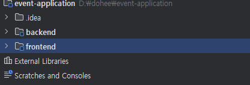

## TIL - 2025.12.04

### 🔍 오늘 배운 내용

#### AWS 클라우드 수동 배포

#### route 53   
왼쪽 메뉴 도메인 > 등록된 도메인   
aws 에서 도메인을 구입하면 배포할 때 편함   
배포와 도메인을 한번에 관리 할 수 있음   
단점: 비쌈

#### 가비아 도메인 구매 > route53 연결

route53 왼쪽 메뉴 > 호스팅영역   
유형 > 퍼블릭 호스팅    

이래야 다른 사람이 접근할 수 있음   
aws 의 ns 레코드(네임서버)  
 
가비아 도메인 관리에서 수정


네임서버를 변경하면 전파를 해야함   
cmd > nslookup -type=NS 도메인 이름 8.8.8.8    
8.8.8.8 은 구글에 물어보는 것 > 전파되는동안 시간이 좀 걸림


#### https 접속을 위한 ssl/tls 인증서 발급받기
aws > acm 검색하고 certificate manager 메뉴로 들어감   
도메인에 대한 인증서 요청 
   
퍼블릭 인증서 요청을 클릭하고 다음 버튼을 클릭하여 인증서 요청을 생성함

cname 뜨는 거 확인하고 route53에서 레코드 생성 클릭


도메인 소유자 확인후 검증완료, 성공, 성공 뜨는 거 확인

#### EC2 인스턴스에 api 배포
ec2 생성, 보안은 내 아이피만 허용   

putty로 ec2 실행 후 하나씩 실행   
sudo dnf update -y     
sudo dnf install -y java-17-amazon-corretto-devel(자바설치)   
sudo dnf install -y git(깃설치)   
sudo dnf install -y mariadb105(mariadb 클라이언드 설치)    

설치 후 깃 클론  
```
git clone 깃 레포 주소
``` 
복사할 목적지 폴더 생성
```
mkdir -p /home/ec2-user/app
```
백엔드 폴더 안의 모든 내용을 /home/ec2-user/app 폴더로 복사   
```
cd -r /home/ec2-user/trAIn-backend/. /home/ec2-user/app   
```

application.yml 파일 설정
```
vi src/main/resources/application.yml
spring: profiles: active: prod
```
prod 운영용으로 변경


#### db연결(rds 생성)

rds 생성 후 ec2 mysql -u admin -p -h rds앤드포인트
rds 연결 안되면 보안 그룹 들어가서 ec2의 보안 그룹을 추가해줘야 함

데이터베이스 연결 확인 후
개발 파일을 jar 파일로 빌드
./gradlew clean build

빌드 실패 확인
./gradlew test --info --stacktrace

테스트 제외하고 jar 파일 빌드
./gradlew build -x test

운영에서 서버 실행
java -jar build/libs/~~.jar 


ec2 환경 변수 파일(.env) 설정
자동 설정해주는 demon?
sudo vi /etc/systemd/system/dialogym.service
env.example 파일 작성

아래는 교안에서 가져온 서비스 등록 관련 명령어다

#### 서비스 등록 및 시작하기

작성한 설명서를 `systemd`가 인식하고, 실제로 서비스를 실행시키는 단계입니다.

```bash
# 1. systemd에 새로운 서비스 파일이 있다는 것을 알립니다.
sudo systemctl daemon-reload

# 2. 서비스를 지금 바로 시작합니다.
sudo systemctl start my-app

# 3. 서버가 부팅될 때마다 자동으로 서비스가 시작되도록 활성화합니다.
sudo systemctl enable my-app
```

#### 서비스 상태 확인하기

서비스가 정상적으로 실행되고 있는지 확인합니다.

```bash
sudo systemctl status my-app
```


#### 알아두면 유용한 `systemd` 명령어 모음

앞으로 서버를 운영하면서 계속 사용하게 될 필수 명령어들입니다.

```bash
# 서비스 중지
sudo systemctl stop my-app

# 서비스 재시작 (코드나 설정 변경 후)
sudo systemctl restart my-app

# 서비스의 실시간 로그 확인 (ctrl + c 로 종료)
sudo journalctl -u my-app -f

# 부팅 시 자동 시작 비활성화
sudo systemctl disable my-app

# 환경변수 등록확인
cat /proc/$(systemctl show --property MainPID --value my-app)/environ | tr '\0' '\n'

```


이렇게 하면 백엔드(API) 배포 완료
api 개발 시 health 체크 추가하여 제대로 배포됨을 확인하는 게 필요할 듯

로드밸런서: 트래픽 분산 및 인증서 처리 역할을 함
https, 도메인 붙이기

ec2 > 로드밸런서 > 대상그룹
로드밸런서에 인증서 연결

도메인과 alb 연결하기
route53 > 호스팅영역 > 레코드 생성
레코드 생성 완료되면 도메인 연결 끝
도메인 연결되도 접속이 불가능 한데 9000번(설정한 값에 따라 다름)을 안열어둬서 그런거임

ec2 > 보안그룹 > 인바운드규칙편집
9000번 포트를 열어줌 근데 anywhere로 하면 http로 접속이 가능하기 때문에 보안에 심각한 위험을 초래함
로드밸런서 설정할 때 만들어둔 대상타겟을 연결해줌

api.~~~.~~ 도메인으로 접속해서 연결되는 지 확인

OAUTH에 백엔드 API 도메인 등록


