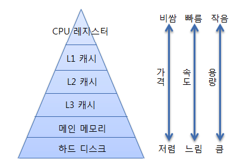
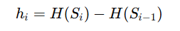

## TIL - 2025.12.12

### 🔍 오늘 배운 내용

#### 운영체제 시험 준비(메모리 할당)

#### 메모리 할당

계층 메모리   
메모리를 필요에 따라 여러 가지 종류로 나누어 둔 것을 계층 메모리라 하며  
CPU가 메모리에 더 빨리 접근하기 위한 목적으로 만들어졌다.  
  

* 레지스터와 캐시는 CPU 내부에 존재하여 CPU는 빠르게 접근할 수 있다.
* 메모리는 CPU 외부에 존재한다. 레지스터와 캐시보다 느리게 접근할 수 밖에 없다.
* 하드디스크는 CPU가 직접 접근할 수 없고 하드디스크의 데이터를 메모리로 이동하고 메모리를 통해 CPU와 접근해야 한다. 당연히 속도가 느릴 수 밖에 없다.   

성능/속도는 캐시, 레지스터 등 상위 레벨의 메모리에 가깝게 하고 비용은 메인 메모리, 하드디스크 등 하위 레벨의 메모리에 가깝게 하는 것을 목표로 한다.   

캐시, 레지스터는 속도가 빠른 대신 가격이 비싸고 하드디스크와 메인메모리의 경우 접근 속도가 느린대신 가격이 저렴하다.

> 캐시 메모리 처럼 빠른 속도를 보장하면서, 전체 용량과 비용은 메인메모리 + 디스크 처럼 저렴하게 하는 것이 목표다.

---

Hit ratio
주어진 메모리 레벨에서, 요청한 정보를 발견할 확률을 의미한다.   
   

Locality of reference   
1. Temporal Locality(시간적 지역성)   
    * 최근에 참조한 데이터/코드를 조금 뒤에 또 참조할 확률이 크다.
    * 루프, 스택, 임시변수 등

2. Spatial Locality(공간적 지역성)
    * 어떤 주소를 참조하면 그 주변 주소들도 곧 참조될 확률이 크다.
    * 배열, 구조체, 연속적인 코드 블록 등

3. sequential Locality(순차적 지역성)
    * 특정 주소를 참조한 직후에 바로 다음 주소를 참조하는 경향을 의미한다.

주어진 예산 안에서 평균액세스 시간을 최소화하는 것이 설계목표

Address Binding   
프로그램 실행을 위해 메모리에 적재할 때 프로그램의 각 명령 데이터가 메모리의 어느 주소에 위치할 지 결정하는 과정, 주소를 한 공간에서 다른 주소 공간으로 변환하는 과정을 의미한다.   

하나의 주소 공간으로부터 다른 주소 공간으로의 매핑이 필요하다.

연습문제

레벨 1 M1
t1=5ns, s1 = 64kb, c1 = 0.12, H(s1) = 0.6

레벨 2 M2
t2 = 0.03us, s2 = 512kb, c2 = 0.03, 0.9

3 M3
t3 = 2ms, s3 = 8mb, c3 = 0.005, 1,0

1.   
F(s1) = H(s1) - H(s1-1) = 0.6 - 0 = 0.6
F(s2) = H(s2) - H(s2-1) = 0.9 - 0.6 = 0.3
F(s3) = H(s3) - H(s3-1) = 1.0 - 0.9 = 0.1

2. 
Ti = i 시그마 k=1 tk 
    = 5ns + 30ns + 2000000ns
    = 2000035ns

3.   
t = 3 시그마 i = 1 F(si)Ti
  = 0.6 * 5 + 0.3 * 30 + 0.1 * 2000000
  = 3 + 9 + 200000
  = 200012ns

4.   
c = 3시그마 i=1 c(ti)Si
  = 0.12 * 64 + 0.03 * 0.5mb + 0.005 * 
       1
  64 1024
      64
      ----

